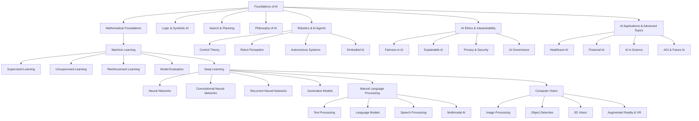

# Artificial Intelligence Overview

Artificial Intelligence (AI) is a broad and interdisciplinary field that encompasses various subdomains, including machine learning, deep learning, robotics, and cognitive computing. Below is a structured map of AI topics and their dependencies.

## 1. Foundations of AI
- **Mathematical Foundations**: Linear algebra, probability, optimization.
- **Logic & Symbolic AI**: First-order logic, rule-based reasoning, expert systems.
- **Search & Planning**: A* search, game theory, reinforcement learning basics.
- **Philosophy of AI**: Turing test, AI ethics, consciousness & intelligence debates.

## 2. Machine Learning
- **Supervised Learning**: Regression, classification, SVMs, decision trees.
- **Unsupervised Learning**: Clustering, dimensionality reduction, anomaly detection.
- **Reinforcement Learning**: Markov decision processes, policy gradient methods.
- **Model Evaluation**: Bias-variance tradeoff, cross-validation, performance metrics.

## 3. Deep Learning
- **Neural Networks**: Backpropagation, activation functions, optimization.
- **Convolutional Neural Networks (CNNs)**: Image recognition, feature extraction.
- **Recurrent Neural Networks (RNNs)**: Sequence learning, LSTMs, transformers.
- **Generative Models**: GANs, VAEs, diffusion models.

## 4. Natural Language Processing (NLP)
- **Text Processing**: Tokenization, embeddings, TF-IDF.
- **Language Models**: n-grams, transformers, BERT, GPT.
- **Speech Processing**: Speech-to-text, text-to-speech, audio embeddings.
- **Multimodal AI**: Combining vision and language (CLIP, Flamingo).

## 5. Computer Vision
- **Image Processing**: Feature extraction, edge detection, image segmentation.
- **Object Detection**: YOLO, Faster R-CNN, Mask R-CNN.
- **3D Vision**: Point clouds, LiDAR, depth estimation.
- **Augmented Reality & VR**: Scene understanding, pose estimation.

## 6. Robotics & AI Agents
- **Control Theory**: PID controllers, Kalman filters.
- **Robot Perception**: SLAM, LiDAR-based navigation.
- **Autonomous Systems**: Self-driving cars, drone intelligence.
- **Embodied AI**: Robotics combined with deep learning.

## 7. AI Ethics & Interpretability
- **Fairness in AI**: Bias detection, algorithmic transparency.
- **Explainable AI (XAI)**: SHAP, LIME, model interpretability.
- **Privacy & Security**: Federated learning, adversarial AI.
- **AI Governance**: Regulations, responsible AI, human-AI collaboration.

## 8. AI Applications & Advanced Topics
- **Healthcare AI**: Medical imaging, drug discovery, patient monitoring.
- **Financial AI**: Fraud detection, trading algorithms.
- **AI in Science**: Protein folding, astrophysics, material discovery.
- **AGI & Future AI**: Scaling laws, emergent behaviors, autonomous reasoning.

## AI Topic Graph

## Study Plan
A structured approach to learning:
1. **Start with Foundations**: Mathematical Logic, Algorithms, Programming.
2. **Move to Core Areas**: Systems, Architecture, Databases.
3. **Explore Specializations**: AI, Cryptography, HCI.
4. **Applications**: Robotics, Quantum Computing, Computational Biology.
