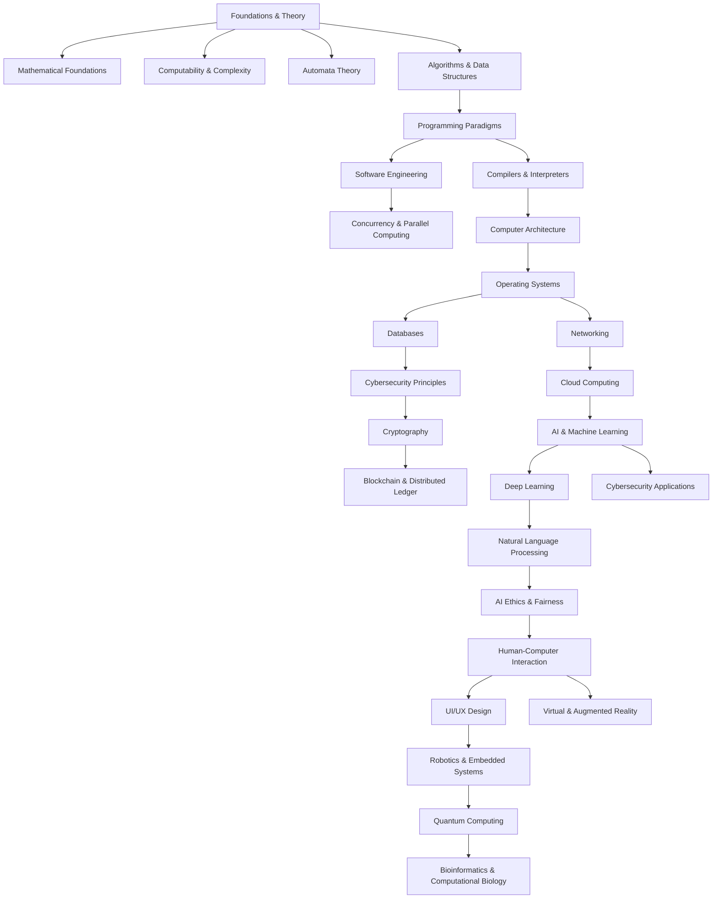

# Computer Science Overview

Computer Science is a broad field with multiple interrelated disciplines. Below is a structured map of key areas and their dependencies.

## 1. Foundations & Theory
- **Mathematical Foundations**: Discrete mathematics, logic, set theory, combinatorics.
- **Computability & Complexity**: Turing machines, P vs NP, circuit complexity.
- **Automata Theory**: Finite state machines, pushdown automata, Turing completeness.
- **Algorithms & Data Structures**: Sorting, searching, dynamic programming, graph algorithms.

## 2. Programming & Software Development
- **Programming Paradigms**: Imperative, functional, object-oriented, declarative.
- **Software Engineering**: Design patterns, version control, software testing, CI/CD.
- **Compilers & Interpreters**: Lexical analysis, parsing, code generation, optimization.
- **Concurrency & Parallel Computing**: Multithreading, synchronization, distributed computing.

## 3. Systems & Architecture
- **Computer Architecture**: CPU design, memory hierarchy, instruction sets.
- **Operating Systems**: Process management, memory management, file systems.
- **Networking**: TCP/IP, routing, network security, cloud computing.
- **Databases**: Relational models, NoSQL, indexing, transaction management.

## 4. Artificial Intelligence & Machine Learning
- **Machine Learning**: Supervised, unsupervised, reinforcement learning.
- **Deep Learning**: Neural networks, CNNs, RNNs, transformers.
- **Natural Language Processing**: Tokenization, sentiment analysis, language models.
- **AI Ethics & Fairness**: Bias mitigation, explainable AI, adversarial learning.

## 5. Cybersecurity & Cryptography
- **Cybersecurity Principles**: Threat models, authentication, access control.
- **Cryptography**: Symmetric & asymmetric encryption, hash functions, zero-knowledge proofs.
- **Blockchain & Distributed Ledger**: Consensus algorithms, smart contracts, DeFi.

## 6. Human-Computer Interaction & UI/UX
- **HCI Principles**: Usability, accessibility, interaction design.
- **UI/UX Design**: Wireframing, prototyping, usability testing.
- **Virtual & Augmented Reality**: 3D rendering, haptics, immersive systems.

## 7. Applied Computer Science
- **Bioinformatics & Computational Biology**: Genomic analysis, protein folding simulations.
- **Quantum Computing**: Qubits, quantum gates, quantum algorithms.
- **Robotics & Embedded Systems**: Control theory, IoT, real-time systems.

## Dependencies & Connections
Understanding computer science involves seeing the relationships between these areas:
- **Mathematics & Theoretical CS**: Foundations for algorithms, cryptography, and AI.
- **Software & Systems**: Compilers bridge programming and architecture.
- **AI & Security**: Machine learning applied to cybersecurity and ethical AI considerations.

## Computer Science Topic Graph

## Study Plan
A structured approach to learning:
1. **Start with Foundations**: Mathematical Logic, Algorithms, Programming.
2. **Move to Core Areas**: Systems, Architecture, Databases.
3. **Explore Specializations**: AI, Cryptography, HCI.
4. **Applications**: Robotics, Quantum Computing, Computational Biology.

This structured graph will help you navigate the interconnections of Computer Science fields. Happy learning!
