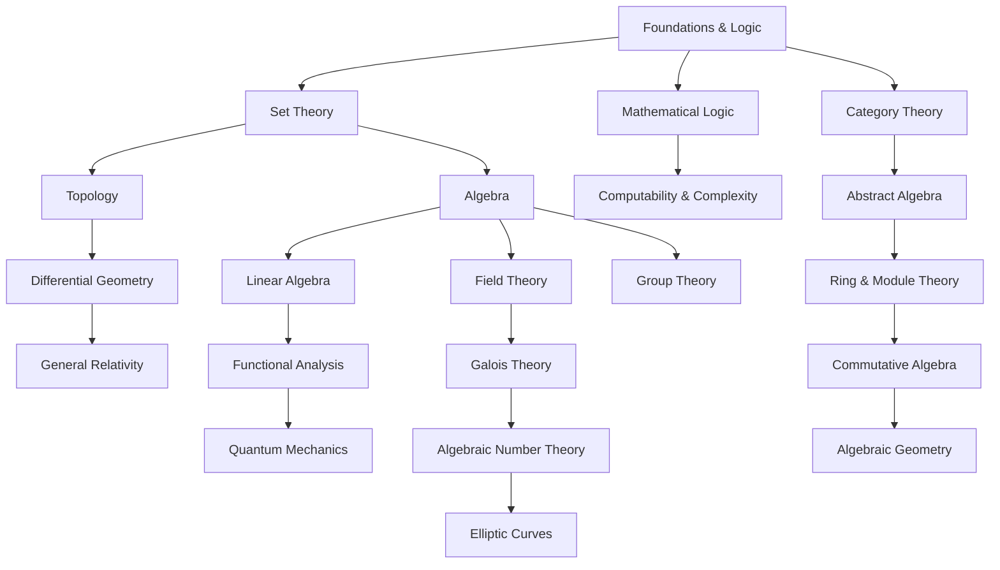

# Mathematics Overview

Mathematics is a vast discipline with deep interconnections. Below is a structured map of major mathematical fields and their dependencies.

## 1. Foundations & Logic
- **Mathematical Logic**: Propositional logic, first-order logic, model theory, computability, set theory.
- **Set Theory**: Axioms of set theory (ZFC), ordinal & cardinal numbers, continuum hypothesis.
- **Category Theory**: Functors, natural transformations, adjoint functors, topos theory.

## 2. Algebra
- **Group Theory**: Cyclic, abelian, symmetric groups, representation theory.
- **Ring & Module Theory**: Ideals, Noetherian rings, modules, homological algebra.
- **Field Theory & Galois Theory**: Extensions, solvability of polynomials, Galois groups.
- **Linear Algebra**: Vector spaces, eigenvalues, Jordan form, bilinear forms.
- **Commutative Algebra**: Prime ideals, localization, Hilbert’s Nullstellensatz.

## 3. Analysis
- **Real Analysis**: Limits, continuity, measure theory, Lebesgue integration.
- **Complex Analysis**: Holomorphic functions, contour integration, Riemann surfaces.
- **Functional Analysis**: Banach spaces, Hilbert spaces, spectral theory.
- **Harmonic Analysis**: Fourier series, distributions, representation theory of Lie groups.

## 4. Geometry & Topology
- **Topology**: Metric spaces, fundamental group, covering spaces, homotopy.
- **Algebraic Topology**: Homology, cohomology, homotopy groups, fiber bundles.
- **Differential Geometry**: Manifolds, Riemannian metrics, geodesics, curvature.
- **Algebraic Geometry**: Affine/projective varieties, sheaves, schemes, moduli spaces.

## 5. Number Theory
- **Elementary Number Theory**: Divisibility, primes, congruences.
- **Algebraic Number Theory**: Number fields, Dedekind domains, class groups.
- **Analytic Number Theory**: Dirichlet series, Riemann zeta function, prime number theorem.
- **Diophantine Geometry**: Elliptic curves, modular forms, rational points.

## 6. Discrete Mathematics & Combinatorics
- **Graph Theory**: Trees, connectivity, coloring, network flows.
- **Enumerative Combinatorics**: Generating functions, partition theory.
- **Extremal & Probabilistic Combinatorics**: Ramsey theory, random graphs.

## 7. Probability & Statistics
- **Probability Theory**: Measure-theoretic probability, martingales, stochastic processes.
- **Statistics**: Bayesian inference, regression, hypothesis testing.
- **Information Theory**: Entropy, coding theory, Shannon’s theorem.

## 8. Applied Mathematics
- **Optimization**: Convex analysis, linear & integer programming.
- **Numerical Analysis**: Root-finding, differential equation solvers, finite element methods.
- **Dynamical Systems & Chaos**: Stability analysis, bifurcations, ergodic theory.

## 9. Mathematical Physics
- **Quantum Mechanics & Representation Theory**: Lie groups & Lie algebras, Hilbert spaces.
- **General Relativity & Differential Geometry**: Pseudo-Riemannian manifolds, geodesic flows.
- **Statistical Mechanics**: Thermodynamic limits, phase transitions, renormalization group.

## 10. Theoretical Computer Science
- **Computability & Complexity**: Turing machines, P vs NP, circuit complexity.
- **Cryptography**: RSA, elliptic curves, post-quantum cryptography.
- **Quantum Computing**: Quantum gates, error correction, quantum algorithms.

## Dependencies & Connections
To fully understand mathematics, one should consider how these fields interconnect:
- **Algebra & Number Theory**: Galois theory is essential for algebraic number theory.
- **Topology & Geometry**: Algebraic topology bridges with differential geometry.
- **Analysis & Probability**: Measure theory is the foundation for probability.
- **Mathematical Physics**: Representation theory connects with quantum mechanics.

## Mathematics Topic Graph

## Study Plan
A structured approach to learning:
1. **Start with Foundations**: Logic, Set Theory, Linear Algebra.
2. **Move to Core Areas**: Analysis, Algebra, Topology.
3. **Explore Specializations**: Number Theory, Geometry, Applied Math.
4. **Applications**: Mathematical Physics, Theoretical Computer Science.

For a visual representation, consider a directed graph showing dependencies between these topics. Happy learning!